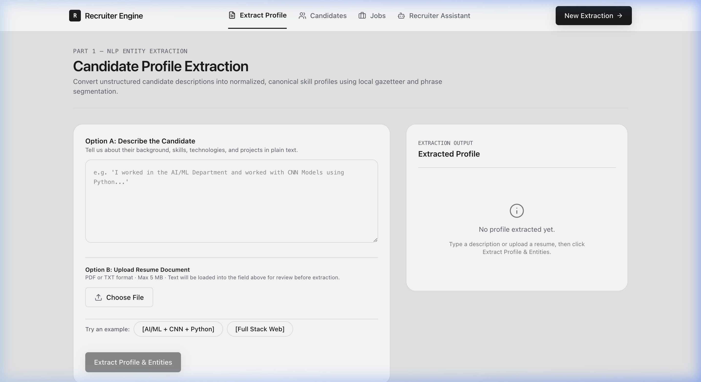
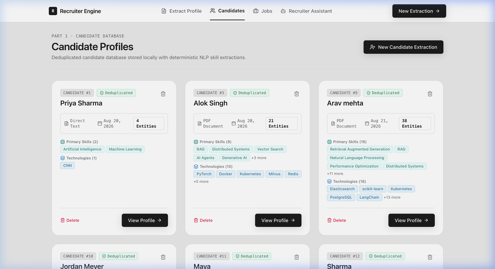
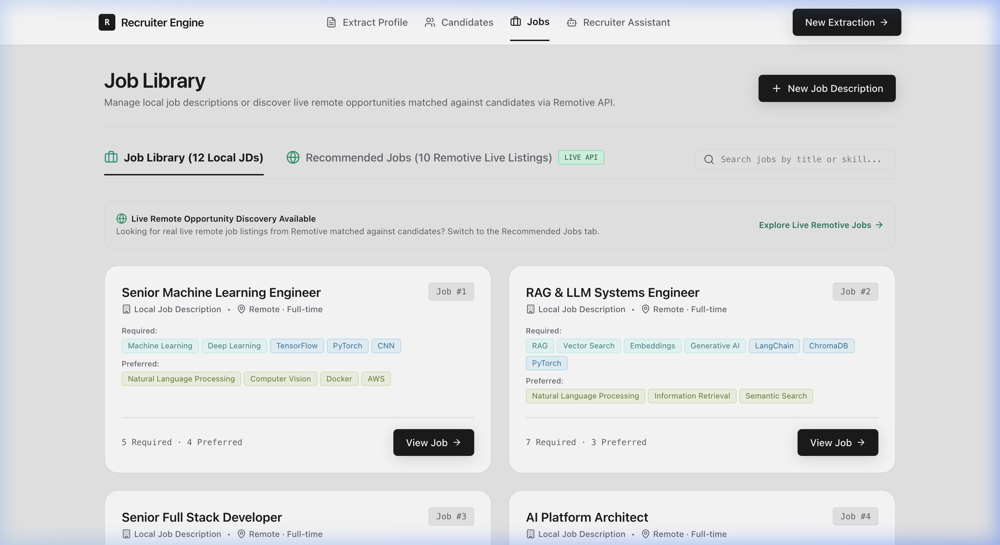
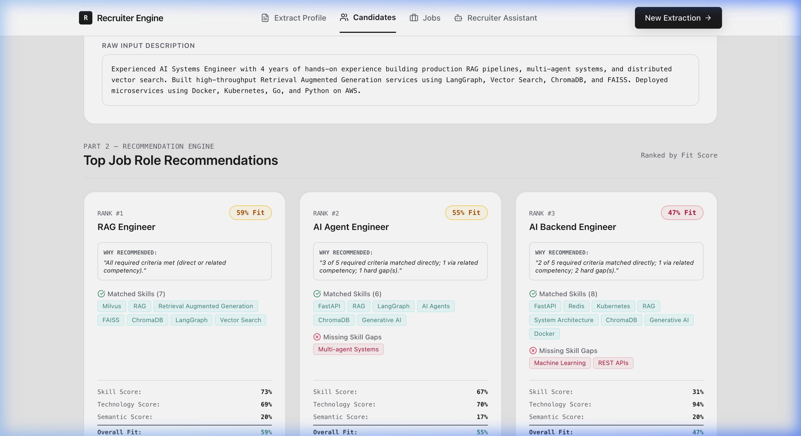
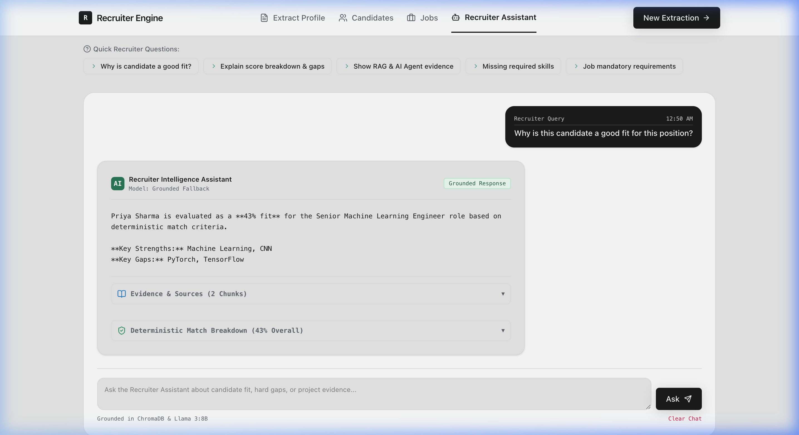
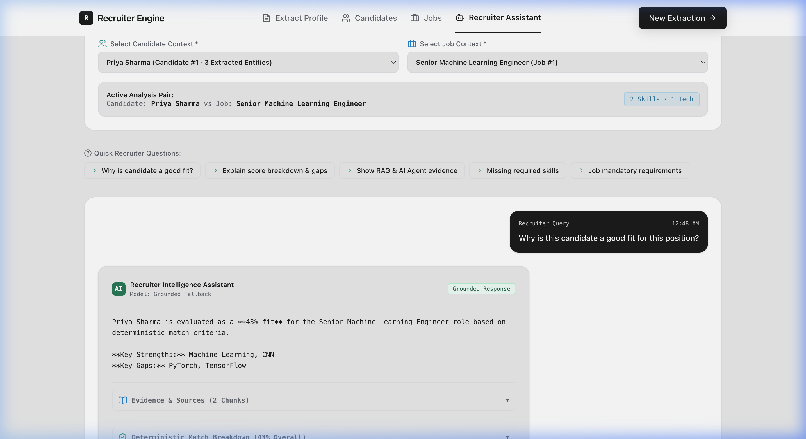

# Recruiter Intelligence Assistant

An AI-powered recruiter assistant that analyzes resumes, builds structured candidate profiles, matches candidates with jobs, recommends real job opportunities, and answers recruiter questions using grounded RAG.

## Project Overview

Recruiter Intelligence Assistant is designed to reduce the time recruiters spend manually reviewing resumes and comparing candidates with job descriptions.

The system takes an uploaded resume and processes it through three main stages:

1. **Candidate Intelligence** — extracts structured information from the resume.
2. **Candidate–Job Matching** — compares the candidate against job requirements using deterministic scoring.
3. **Recruiter Intelligence Assistant** — answers recruiter questions using RAG, ChromaDB, and a local Llama 3:8B model.

The system also integrates the Remotive API to retrieve real job listings instead of generating fictional recommendations.

---

## Problem Statement

Recruiters often have to manually:

- Read and understand resumes.
- Extract skills and technologies.
- Identify relevant projects and experience.
- Compare candidates against job descriptions.
- Determine missing skills.
- Search for suitable job opportunities.
- Verify whether an AI-generated answer is actually supported by the resume.

Traditional keyword-based matching can miss related skills, while fully LLM-based systems can produce inconsistent scores or hallucinate information.

This project addresses these problems by combining structured extraction, deterministic matching, targeted retrieval, and grounded LLM responses.

---

## Key Features

- Resume upload and structured information extraction.
- Candidate profile generation.
- Extraction of skills, technologies, experience, education, projects, and other entities.
- Job requirement analysis.
- Deterministic candidate-job matching.
- Skill, technology, and semantic match scores.
- Direct matches, related competencies, and hard-gap detection.
- Real job listings through the Remotive API.
- Recruiter-focused RAG assistant.
- Query understanding and intent classification.
- Section-aware ChromaDB retrieval.
- Intent-aware reranking.
- Evidence sufficiency checking.
- Grounded responses using local Llama 3:8B through Ollama.
- Evidence and source citations.
- Protection against unsupported claims and score manipulation.
- Candidate and job data isolation.

---

## System Architecture

```text
                         RESUME
                           |
                           v
                  Resume Extraction
                           |
                           v
                 Candidate Profile
                           |
             +-------------+-------------+
             |                           |
             v                           v
       Job Matching                 RAG Indexing
             |                           |
             v                           v
   Deterministic Scoring              ChromaDB
             |                           |
             |                           v
             |                  Query Understanding
             |                           |
             |                           v
             |                  Retrieval Planning
             |                           |
             |                           v
             |                  Section Filtering
             |                           |
             |                           v
             |                       Reranking
             |                           |
             |                           v
             |                    Evidence Checking
             |                           |
             |                           v
             |                       Llama 3:8B
             |                           |
             +-------------+-------------+
                           |
                           v
                 Recruiter Assistant

                            +
                            |
                            v
                      Remotive API
                            |
                            v
                    Real Job Listings
```

Detailed technical breakdown available in [`docs/ARCHITECTURE.md`](docs/ARCHITECTURE.md).
Empirical proof of local Ollama (Llama 3 / Llama 3:8B) integration available in [`docs/PROOF_OF_OLLAMA_INTEGRATION.md`](docs/PROOF_OF_OLLAMA_INTEGRATION.md).

---

## Application Screenshots

### 1. Resume & Profile Extraction


### 2. Candidate Profiles & Extracted Entity Directory


### 3. Job Profiles & Mandatories


### 4. Deterministic Match Scoring & Hard-Gap Breakdown


### 5. Recruiter Intelligence Assistant (RAG + Local Ollama)


### 6. Grounded Evidence Citations & Source Verification

