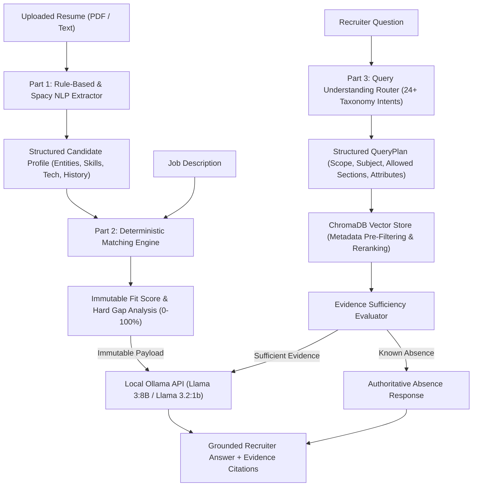

# System Architecture & Technical Specifications

## Architectural Overview

The AI Recruiter platform is built on a strict, 3-tier decoupled architecture designed for high precision, zero hallucination on match scores, and complete privacy with **0% external LLM API cost**.



---

## Technical Decoupling Principle

### Why Deterministic Scoring $\neq$ RAG $\neq$ LLM Generation

One of the foundational technical decisions in this platform is the absolute separation of **Deterministic Fit Calculation**, **Retrieval**, and **LLM Natural Language Synthesis**.

```
┌───────────────────────────────────────────────────────────────────────────┐
│                           DECOUPLED PIPELINE                              │
├──────────────────────────┬──────────────────────────┬─────────────────────┤
│   Part 1: Extraction     │   Part 2: Fit Scoring    │  Part 3: RAG Q&A    │
│  (spaCy / Regex / Rules) │ (Canonical Math Engine)  │ (ChromaDB + Ollama) │
└──────────────────────────┴──────────────────────────┴─────────────────────┘
```

### 1. Part 1: Rule-Based & Spacy NLP Extraction
- Parses multi-page PDF resumes into structured JSON profiles (Name, Skills, Technologies, Languages, Education, Employment, Projects).
- Normalizes canonical skill aliases (e.g. `JS` $\rightarrow$ `JavaScript`, `Postgres` $\rightarrow$ `PostgreSQL`, `K8s` $\rightarrow$ `Kubernetes`).
- Maintains raw resume text and section boundaries for downstream evidence lookup.

### 2. Part 2: Deterministic Matching Engine
- **Mathematical Immutability**: Candidate-to-Job fit scores are computed using weighted canonical skill overlap, alias expansion, related competency partial credit ($0.5\times$), and mandatory hard-gap penalties:
  $$\text{Fit Score} = w_{\text{skill}} \cdot S_{\text{skill}} + w_{\text{tech}} \cdot S_{\text{tech}} + w_{\text{semantic}} \cdot S_{\text{semantic}}$$
- **Zero LLM Score Alteration**: The fit percentage (e.g., $78\%$) is calculated deterministically. The LLM is **never** permitted to calculate, guess, or override match percentages.

### 3. Part 3: Query Understanding & Grounded RAG
- **Multi-Signal Query Classifier**: Maps recruiter questions into 24+ domain taxonomy intents with strict section policies (`CANDIDATE_EDUCATION` $\rightarrow$ `["education"]`, `CANDIDATE_SKILLS` $\rightarrow$ `["skills_summary"]`, `PROJECT_DETAIL` $\rightarrow$ `["projects"]`).
- **Metadata Section Filtering & Reranking**: Filters ChromaDB vector chunks by target section before cosine similarity scoring, preventing cross-section evidence drift.
- **Evidence Sufficiency Evaluator**: Checks candidate facts before generation. If a technology or claim is absent (e.g., Rust or Stanford experience), an authoritative absence response is returned without triggering LLM hallucinations.
- **Constrained LLM Synthesis (Ollama)**: Local Llama model receives only the retrieved section chunks and Part 2 match payload to generate 1–3 concise response sentences with direct citations.

---

## Data Model & Isolation

- **Candidate Isolation**: Vector store chunks and SQLite candidate profiles are partitioned by `candidate_id` to prevent cross-candidate data leakage.
- **Job Isolation**: Job requirement chunks are indexed under `job_id` for accurate role responsibilities and mandatory tech stack inquiries.
